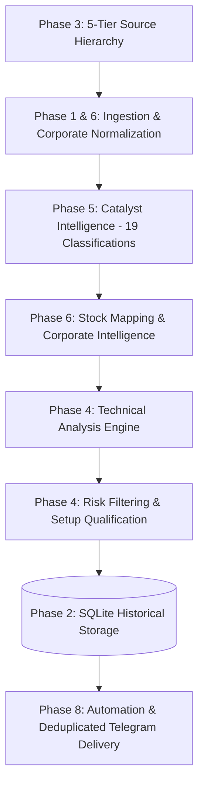

# Scheme Intel

A comprehensive evidence-led monitor, intelligence pipeline, and quantitative swing analytics platform for India's renewable energy, bio-energy, and compressed biogas ecosystem (GOBARdhan, SATAT, National Bioenergy Programme, Ethanol Blending).

It scans official government sources, corporate disclosures, and financial feeds, detects material policy and contract catalysts, maps them to a stock watchlist, verifies source reliability, computes quantitative swing trade setups, tracks historical performance in SQLite, and sends deduplicated Telegram alerts.

---

## Stage 1 Architecture & Phases



### Complete Phase Breakdown

- **Phase 1 — Code Quality & Testing**: 295 automated unit and integration tests (100% passing), structured logging, custom error hierarchies, YAML configuration schema validation, GitHub Actions CI matrix, and zero hardcoded secrets.
- **Phase 2 — Data & Analytics**: Persistent SQLite storage (`data/scheme_intel.db`) containing runs, catalysts, setups, trades, and `historical_prices`. Tracks setup outcomes, win/loss rates, Maximum Drawdown (MDD), technical indicator effectiveness, and daily/weekly/monthly returns.
- **Phase 3 — Source Reliability**: 5-Tier Source Hierarchy (Tier 1 Government/Exchange down to Tier 5 Unverified Social), credibility scoring, cross-source corroboration, conflicting-source sentiment detection, stale information detection (> 72 hours), and evidence narratives.
- **Phase 4 — Technical Analysis Engine**: Trend analysis (20, 50, 100, and 200 DMAs), momentum (RSI-14, MACD 12/26/9, ROC-10, ROC-21), breakout filters (20-day high, 50-day high, volume breakout ratio, breakout distance %), volatility profiling (ATR-14, ATR %, volatility regime classification), price structure (support, resistance, swing high/low), and relative strength against NIFTY.
- **Phase 5 — Catalyst Intelligence**: Full 19 catalyst classifications (Government policy, Scheme announcement, Cabinet approval, Tender, Order win, Capacity expansion, Plant commissioning, Subsidy, Pricing change, Regulatory change, JV/partnership, Capex, Acquisition, Results, Management commentary, Investor presentation, Earnings call, Analyst report, Industry development) with rich metadata (duration, sector, scheme, segment, sentiment).
- **Phase 6 — Company Intelligence**: Corporate disclosure ingestion (NSE/BSE, concalls, earnings, analyst research), structured dimension extraction (What changed, Capex, orders, margins, capacity, guidance, risks), directly feeding the catalyst pipeline.
- **Phase 7 — Documentation & Usability**: Detailed guides covering architecture, configuration, data models, source tiers, testing, and troubleshooting.
- **Phase 8 — Automation & Delivery**: Multi-chat Telegram notifications, alert levels (`INFO`, `QUALIFIED`, `CRITICAL`), stateful duplicate alert suppression in SQLite, exponential backoff retries, daily briefings, and scheduled GitHub Actions workflows.

---

## Quick Start

```bash
# Clone repository
git clone https://github.com/botv99/scheme-intel.git
cd scheme-intel

# Setup virtual environment
python -m venv .venv
.venv\Scripts\activate          # Windows: .venv\Scripts\activate | Linux: source .venv/bin/activate
pip install -r requirements.txt

# Run the test suite
python run_tests.py --no-coverage

# Run the full pipeline scan
python -m scheme_intel.main

# Run with Telegram alerts enabled
export TELEGRAM_BOT_TOKEN="your-bot-token"
export TELEGRAM_CHAT_ID="your-chat-id"
python -m scheme_intel.main --send
```

---

## CLI Tools

### 1. Main Pipeline
```bash
python -m scheme_intel.main              # scan & store run locally
python -m scheme_intel.main --send       # scan, store, and dispatch Telegram alerts
```

### 2. Trade Tracker & Performance Analytics
```bash
python -m scheme_intel.tracker record --company "TruAlt" --symbol TRUALT.NS --entry 220 --stop 200 --target 260
python -m scheme_intel.tracker close --trade-id 1 --exit 245.50 --outcome WIN
python -m scheme_intel.tracker status
python -m scheme_intel.tracker dashboard
```

### 3. Data Ingestion & Snapshot Refresh
```bash
python -m scheme_intel.ingest             # refresh news, prices, and announcements
```

---

## Multi-Provider LLM Architecture (Stage 2)

Scheme-Intel features a **provider-agnostic, failover-based** multi-agent LLM routing layer for adversarial swing setup analysis:

- **Supported Providers**: Google Gemini, Groq, OpenRouter, OpenAI, and deterministic synthesis fallback.
- **Dynamic Routing & Cooldown**: Per-request routing based on available API keys (`LLM_PROVIDER_ORDER`). Automatically recovers from HTTP 429 quota exhaustion by applying cooldowns (respecting `Retry-After`) and failing over to the next provider seamlessly.
- **Failover Hierarchy**: Live LLM Provider → Alternate Live LLM Provider → Deterministic Synthesis → Hard Mathematical Risk Engine → Waiting Engine → Telegram.
- **Configuration**:
  - `GEMINI_API_KEY`, `GEMINI_MODEL` (default: `gemini-3.8-flash`)
  - `GROQ_API_KEY`, `GROQ_MODEL` (default: `openai/gpt-oss-safeguard-20b`)
  - `OPENROUTER_API_KEY`, `OPENROUTER_MODEL` (default: `liquid/lfm-2.5-2.6b:free`)
  - `OPENAI_API_KEY`, `OPENAI_MODEL` (default: `gpt-4o-mini`)
  - `LLM_PROVIDER_ORDER` (default: `groq,openrouter,gemini,openai`)

---

## Forward Performance Analytics & Validation Engine

Scheme-Intel automatically computes forward performance analytics from historical setups and tracked execution outcomes:

- **Zero Lookahead Leakage**: Forward validation strictly respects chronological setup dates, ensuring setups evaluated at $T_1$ never have access to outcomes occurring after $T_1$.
- **Objective Mathematical Formulas**:
  - Win rate: $\frac{\text{Wins}}{\text{Completed Trades}}$ (untriggered setups are **never** counted as losses).
  - Profit Factor: $\frac{\text{Gross Profit}}{\text{|Gross Loss|}}$.
  - Expectancy: $(\text{Win Rate} \times \text{Avg Win}) + (\text{Loss Rate} \times \text{Avg Loss})$ per triggered trade.
- **Data-Sufficiency Guards**: Enforces strict sample-size thresholds (`MIN_COMPLETED_TRADES = 30`, `MIN_ARCHETYPE_SAMPLE = 20`, `MIN_STOCK_SAMPLE = 20`). Clearly labels immature performance as `INSUFFICIENT_SAMPLE` or `PRELIMINARY` and prevents misleading statistical claims.
- **Comprehensive Breakdowns**: Archetype, Symbol, AI Provider (observational), and Candidate Score Bands.
- **Automated Reporting**:
  - Machine-readable: `data/performance/latest.json`
  - Human-readable: `data/performance/latest.md`
  - Compact Telegram summary (only displays full validated statistics when sample size meets validation thresholds).

---

## Stage 3: Telegram Conversational Intelligence & Operational Runtime

Scheme-Intel provides a dual-path conversational terminal inside Telegram:

### Dual-Path Request Architecture
1. **Path A — Fast Memory Retrieval (< 100ms)**:
   - Reads directly from prebuilt in-memory `IntelligenceSnapshot` (`data/latest.json`).
   - **Strict Fast-Path Protection**: `auto_build_if_missing = False`. Telegram queries **never** trigger data ingestion, strategy pipeline recalculation, or LLM debates.
   - Snapshot health is categorized as `READY`, `STALE` (> 26h), `MISSING`, or `INVALID`.
2. **Path B — Deep Research Queue & Worker**:
   - Long-form or deep questions triggered via `/research <question>`.
   - Persisted to SQLite queue (`research_jobs`).
   - Asynchronous worker processes jobs, corroborates policy evidence, and pushes Markdown findings back to the user's Telegram chat upon completion.
   - Built-in crash recovery: abandoned `RUNNING` jobs (> 300s) are automatically reset to `QUEUED`.

### Supported Commands
- `/start` or `/help`: Overview of available commands and navigation syntax.
- `/health` or `/status`: Real-time system operational health probe.
- `/schemes`: List of supported policy schemes (e.g., GOBARdhan).
- `/scheme <id>`: Scheme overview, policy developments, and active watchlist.
- `/setups`: Current session's qualified swing setups with trigger, stop loss, and targets.
- `/waiting`: Setups awaiting trigger confirmation or volume expansion.
- `/performance`: Forward validation statistics, win rate, and sample maturity.
- `/benchmark`: Alpha and win rate comparisons against the Nifty 50 benchmark.
- `<SYMBOL>` or `/stock <SYM>`: Compact technical and fundamental status card.
- `/why <SYM>`, `/what <SYM>`, `/when <SYM>`: Policy rationale, recent developments, and execution triggers.
- `/research <question>`: Asynchronous background policy research request.

### Operational Service Deployment
Run the production runtime coordinating the conversational bot and research worker:

```bash
# Run both Telegram Poller and Async Research Worker
python -m scheme_intel.delivery.service --mode all

# Run Bot Poller only
python -m scheme_intel.delivery.service --mode bot

# Run Research Queue Worker only
python -m scheme_intel.delivery.service --mode worker

# Run non-destructive system health probe
python -m scheme_intel.delivery.service --health

# Run with container HTTP health probe port
python -m scheme_intel.delivery.service --mode all --port 8080
```

### Docker Deployment
```bash
docker build -t scheme-intel:latest .
docker run -d \
  -e TELEGRAM_BOT_TOKEN="your-token" \
  -e TELEGRAM_CHAT_ID="your-chat-id" \
  -p 8080:8080 \
  scheme-intel:latest
```

---

## Documentation Suite

Detailed architectural specifications and references are available in [`docs/`](docs/):

- [Architecture & Processing Flow](docs/ARCHITECTURE.md)
- [Configuration Reference](docs/CONFIGURATION.md)
- [Database Schema & Data Model](docs/DATA_MODEL.md)
- [Source Hierarchy & Feeds](docs/SOURCES.md)
- [Testing Guide](docs/TESTING.md)
- [Troubleshooting & FAQ](docs/TROUBLESHOOTING.md)
- [Changelog](docs/CHANGELOG.md)

