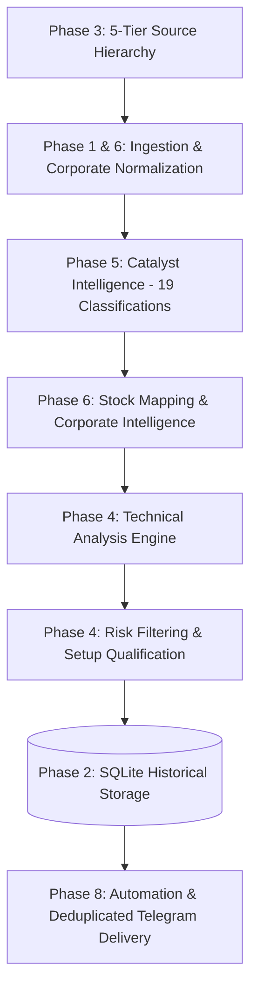

# Scheme Intel

A comprehensive evidence-led monitor, intelligence pipeline, and quantitative swing analytics platform for India's renewable energy, bio-energy, and compressed biogas ecosystem (GOBARdhan, SATAT, National Bioenergy Programme, Ethanol Blending).

It scans official government sources, corporate disclosures, and financial feeds, detects material policy and contract catalysts, maps them to a stock watchlist, verifies source reliability, computes quantitative swing trade setups, tracks historical performance in SQLite, and sends deduplicated Telegram alerts.

---

## Stage 1 Architecture & Phases



### Complete Phase Breakdown

- **Phase 1 — Code Quality & Testing**: 295 automated unit and integration tests (100% passing), structured logging, custom error hierarchies, YAML configuration schema validation, GitHub Actions CI matrix, and zero hardcoded secrets.
- **Phase 2 — Data & Analytics**: Persistent SQLite storage (`data/scheme_intel.db`) containing runs, catalysts, setups, trades, and `historical_prices`. Tracks setup outcomes, win/loss rates, Maximum Drawdown (MDD), technical indicator effectiveness, and daily/weekly/monthly returns.
- **Phase 3 — Source Reliability**: 5-Tier Source Hierarchy (Tier 1 Government/Exchange down to Tier 5 Unverified Social), credibility scoring, cross-source corroboration, conflicting-source sentiment detection, stale information detection (> 72 hours), and evidence narratives.
- **Phase 4 — Technical Analysis Engine**: Trend analysis (20, 50, 100, and 200 DMAs), momentum (RSI-14, MACD 12/26/9, ROC-10, ROC-21), breakout filters (20-day high, 50-day high, volume breakout ratio, breakout distance %), volatility profiling (ATR-14, ATR %, volatility regime classification), price structure (support, resistance, swing high/low), and relative strength against NIFTY.
- **Phase 5 — Catalyst Intelligence**: Full 19 catalyst classifications (Government policy, Scheme announcement, Cabinet approval, Tender, Order win, Capacity expansion, Plant commissioning, Subsidy, Pricing change, Regulatory change, JV/partnership, Capex, Acquisition, Results, Management commentary, Investor presentation, Earnings call, Analyst report, Industry development) with rich metadata (duration, sector, scheme, segment, sentiment).
- **Phase 6 — Company Intelligence**: Corporate disclosure ingestion (NSE/BSE, concalls, earnings, analyst research), structured dimension extraction (What changed, Capex, orders, margins, capacity, guidance, risks), directly feeding the catalyst pipeline.
- **Phase 7 — Documentation & Usability**: Detailed guides covering architecture, configuration, data models, source tiers, testing, and troubleshooting.
- **Phase 8 — Automation & Delivery**: Multi-chat Telegram notifications, alert levels (`INFO`, `QUALIFIED`, `CRITICAL`), stateful duplicate alert suppression in SQLite, exponential backoff retries, daily briefings, and scheduled GitHub Actions workflows.

---

## Quick Start

```bash
# Clone repository
git clone https://github.com/botv99/scheme-intel.git
cd scheme-intel

# Setup virtual environment
python -m venv .venv
.venv\Scripts\activate          # Windows: .venv\Scripts\activate | Linux: source .venv/bin/activate
pip install -r requirements.txt

# Run the test suite
python run_tests.py --no-coverage

# Run the full pipeline scan
python -m scheme_intel.main

# Run with Telegram alerts enabled
export TELEGRAM_BOT_TOKEN="your-bot-token"
export TELEGRAM_CHAT_ID="your-chat-id"
python -m scheme_intel.main --send
```

---

## CLI Tools

### 1. Main Pipeline
```bash
python -m scheme_intel.main              # scan & store run locally
python -m scheme_intel.main --send       # scan, store, and dispatch Telegram alerts
```

### 2. Trade Tracker & Performance Analytics
```bash
python -m scheme_intel.tracker record --company "TruAlt" --symbol TRUALT.NS --entry 220 --stop 200 --target 260
python -m scheme_intel.tracker close --trade-id 1 --exit 245.50 --outcome WIN
python -m scheme_intel.tracker status
python -m scheme_intel.tracker dashboard
```

### 3. Data Ingestion & Snapshot Refresh
```bash
python -m scheme_intel.ingest             # refresh news, prices, and announcements
```

---

## Documentation Suite

Detailed architectural specifications and references are available in [`docs/`](docs/):

- [Architecture & Processing Flow](docs/ARCHITECTURE.md)
- [Configuration Reference](docs/CONFIGURATION.md)
- [Database Schema & Data Model](docs/DATA_MODEL.md)
- [Source Hierarchy & Feeds](docs/SOURCES.md)
- [Testing Guide](docs/TESTING.md)
- [Troubleshooting & FAQ](docs/TROUBLESHOOTING.md)
- [Changelog](docs/CHANGELOG.md)
