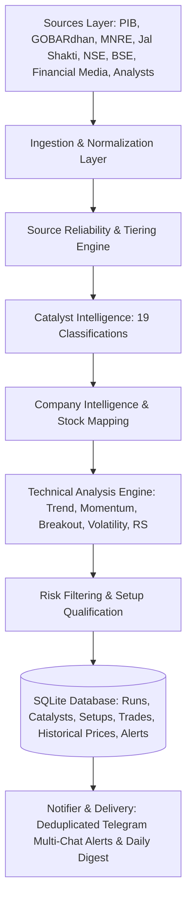

# Scheme Intel — System Architecture

## Overview
Scheme Intel is an automated intelligence and quantitative swing analysis platform designed for India's renewable energy, circular economy, and bio-energy ecosystem (GOBARdhan, SATAT, National Bioenergy Programme, Ethanol Blending Programme).

---

## End-to-End Pipeline Architecture

---

## Step-by-Step Processing Sequence

1. **Source Collection**:
   - Scans 5 tiers of sources: Official Government portals, corporate exchange filings, established business media, and equity analyst feeds.
2. **Ingestion & Normalization**:
   - Deduplicates raw headlines and texts via fuzzy SequenceMatcher.
   - Cleans HTML, standardizes timestamps into UTC and IST.
   - Fetches and caches historical OHLCV series.
3. **Source Reliability & Tiering**:
   - Categorizes sources from **Tier 1 (Official Govt/Regulator)** to **Tier 5 (Unverified Social)**.
   - Computes persistent success/error rates in SQLite.
   - Detects cross-source corroboration and conflicting reports.
   - Flags stale publications (> 72 hours).
4. **Catalyst Classification**:
   - Classifies articles into one of 19 defined Stage 1 catalyst classifications.
   - Extracts rich metadata: headline, materiality score (0-100), duration, business segment, scheme, sector, and sentiment.
5. **Company Intelligence & Stock Mapping**:
   - Maps news to company names and aliases from `watchlist.yaml`.
   - Extracts structured dimensions: Capex, orders, margins, capacity, management guidance, and risks.
   - Converts corporate disclosures and analyst updates into catalyst objects.
6. **Technical Analysis Engine**:
   - Calculates 20, 50, 100, and 200 DMAs.
   - Evaluates momentum: RSI(14), MACD(12,26,9), and Rate of Change (ROC-10, ROC-21).
   - Verifies 20-day and 50-day breakout with 1.5x trailing average volume confirmation.
   - Calculates ATR(14), ATR %, and classifies the volatility regime.
   - Identifies support, resistance, and recent swing highs/lows.
   - Measures relative strength (RS) against benchmark indices.
7. **Risk Checks & Setup Generation**:
   - Filters candidates through trend, volume breakout, RSI sweet spot (50–70), MACD histogram positive, and minimum catalyst score.
   - Sets dynamic entry trigger, volatility-adjusted stop loss (2x ATR), and 2:1 reward-to-risk target.
8. **Persistence**:
   - Saves runs, catalysts, setups, trades, and historical prices to `data/scheme_intel.db`.
   - Maintains `data/latest.json` for snapshot viewing.
9. **Delivery & Notifications**:
   - Dispatches formatted Telegram alerts with level tags (`INFO`, `QUALIFIED`, `CRITICAL`).
   - Prevents duplicate alerts via SQLite state tracking.
   - Formats daily digests of market developments and qualified setups.
