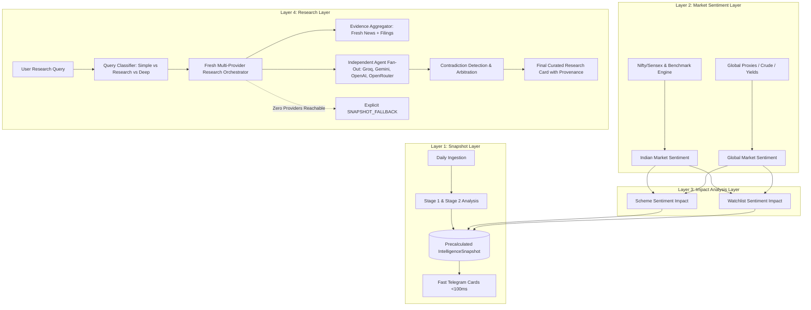

# Scheme Intel — System Architecture & Intelligence Engine (Stage 3)

## Overview
Scheme Intel is an automated intelligence and quantitative swing analysis platform designed for India's renewable energy, circular economy, and bio-energy ecosystem (GOBARdhan, SATAT, National Bioenergy Programme, Ethanol Blending Programme).

---

## High-Level Architectural Layers

The system maintains a strict architectural separation between four primary layers:


```mermaid
graph TD
    subgraph Layer 1: Snapshot Layer
        A1[Daily Ingestion] --> A2[Stage 1 & Stage 2 Analysis]
        A2 --> A3[(Precalculated IntelligenceSnapshot)]
        A3 --> A4[Fast Telegram Cards <100ms]
    end

    subgraph Layer 2: Market Sentiment Layer
        B1[Nifty/Sensex & Benchmark Engine] --> B3[Indian Market Sentiment]
        B2[Global Proxies / Crude / Yields] --> B4[Global Market Sentiment]
    end

    subgraph Layer 3: Impact Analysis Layer
        B3 & B4 --> C1[Scheme Sentiment Impact]
        B3 & B4 --> C2[Watchlist Sentiment Impact]
        C1 & C2 --> A3
    end

    subgraph Layer 4: Research Layer
        D1[User Research Query] --> D2[Query Classifier: Simple vs Research vs Deep]
        D2 --> D3[Fresh Multi-Provider Research Orchestrator]
        D3 --> D4[Evidence Aggregator: Fresh News + Filings]
        D3 --> D5[Independent Agent Fan-Out: Groq, Gemini, OpenAI, OpenRouter]
        D5 --> D6[Contradiction Detection & Arbitration]
        D6 --> D7[Final Curated Research Card with Provenance]
        D3 -.->|Zero Providers Reachable| D8[Explicit SNAPSHOT_FALLBACK]
    end
```

---

## 1. Snapshot Architecture

- **Purpose**: Fast, lookahead-free morning intelligence cards, historical trade outcomes, and Telegram daily briefs.
- **Contract**: `IntelligenceSnapshot` (in `src/scheme_intel/intelligence_memory/models.py`).
- **Storage**: `data/intelligence/latest.json`.
- **Builder**: `IntelligenceSnapshotBuilder` (in `src/scheme_intel/intelligence_memory/builder.py`).
- **Snapshot Contents**:
  - `snapshot_id`: Versioned ID (e.g. `SNAP-YYYYMMDD-HHMMSS`).
  - `schemes`: Active scheme statistics and developments.
  - `companies`: 100% watchlist coverage including prices, trends, scores, catalysts, and setup status.
  - `qualified_setups` & `waiting_setups`: Current stage 2 trade signals.
  - `performance` & `benchmark`: Forward validation and Nifty 50 comparison.
  - `market_and_global_sentiment`: Dedicated section containing today's Indian Market Sentiment, Global Sentiment, Scheme Impacts, and Watchlist Impacts.
- **Rule**: Snapshot facts provide background context for research queries, but are **never** treated as an authoritative substitute for fresh research.

---

## 2. Research Architecture

- **Flow**:
  1. `QueryClassifier` classifies input into `SIMPLE_QUERY`, `RESEARCH_QUERY`, or `DEEP_RESEARCH`.
  2. For `RESEARCH_QUERY` and `DEEP_RESEARCH`, `ResearchOrchestrator` is triggered.
  3. Gathers fresh evidence from recent exchange announcements, news (`data/ingested.json`), and monitored government portals.
  4. Fans out independent analysis across multiple configured AI providers.
  5. Agent Roles:
     - **Fact / Neutral Agent**: Gathers objective factual observations directly supported by evidence.
     - **Bull Analyst Agent**: Analyzes upside drivers, volume expansion, and commercial policy incentives.
     - **Bear Analyst Agent (Trade Killer)**: Analyzes downside friction, execution delay, and valuation resistance.
     - **Arbiter Agent**: Detects cross-agent contradictions, evaluates evidence balance, and renders a verdict (`BULL`, `BEAR`, or `MIXED`).
  6. Returns structured provenance (participating providers, models, duration, evidence count, confidence).

---

## 3. Provider Abstraction & Registry

- **Base Class**: `AIProvider` / `LLMProvider` in `src/scheme_intel/stage2/providers/base.py`.
- **Central Registry**: `ProviderRegistry` in `src/scheme_intel/research/providers.py`.
- **Pre-Configured Providers**:
  - `GroqProvider`: Ultra-fast inference (`GROQ_API_KEY`, `GROQ_MODEL`).
  - `GeminiProvider`: Google DeepMind Gemini models (`GEMINI_API_KEY` or `GOOGLE_API_KEY`, `GEMINI_MODEL`).
  - `OpenAIProvider`: OpenAI models (`OPENAI_API_KEY`, `OPENAI_MODEL`).
  - `OpenRouterProvider`: OpenRouter gateway for open-source models (`OPENROUTER_API_KEY`, `OPENROUTER_MODEL`).
- **Dynamic Fan-out**: The orchestrator discovers configured providers dynamically and routes distinct agent roles to distinct providers rather than simple sequential failover.

---

## 4. Market Sentiment Architecture (Indian Market)

- **Component**: `IndianMarketSentiment` (in `src/scheme_intel/intelligence/market_sentiment.py`).
- **Scoring Methodology (Deterministic Composite -100 to +100)**:
  - **Nifty 50 Benchmark (40% Weight)**: Day return threshold (+/- 30 pts) and 20-DMA trend (+/- 10 pts).
  - **Watchlist Market Breadth (35% Weight)**: Net advances minus declines scaled by active watchlist size.
  - **News & Policy Catalysts (25% Weight)**: Ratio of positive vs negative official policy announcements.
  - **Thresholds**:
    - Score > +15.0: `BULLISH`
    - Score < -15.0: `BEARISH`
    - Otherwise: `NEUTRAL`
- **Missing Value Rule**: Missing market data is reported as `UNAVAILABLE` or `None`. Values are never hallucinated.

---

## 5. Global Market Sentiment Architecture

- **Component**: `GlobalMarketSentiment` (in `src/scheme_intel/intelligence/market_sentiment.py`).
- **Macro Indicators**: US index direction, Brent crude oil benchmark, US 10Y Treasury yields, US Dollar Index (DXY), Gold, commodities, and Risk Regime (`RISK_ON`, `RISK_OFF`, `NEUTRAL`).
- **Scoring**: Grounded strictly in available international reports. Missing indicators remain `None`.

---

## 6. Scheme Impact Architecture

- **Component**: `SchemeSentimentImpact` (in `src/scheme_intel/intelligence/market_sentiment.py`).
- **Function**: Translates Indian and Global sentiment into scheme-specific policy and commercial implications.
- **Channels**: Crude-to-gas parity, central subsidy releases, banking credit availability, and domestic infrastructure capex.
- **Directional Impact**: `POSITIVE`, `NEGATIVE`, `NEUTRAL`, or `MIXED`.
- **Safety**: Strictly analytical interpretation; non-investment recommendation disclaimer embedded.

---

## 7. Watchlist Impact Architecture

- **Component**: `WatchlistSentimentImpact` (in `src/scheme_intel/intelligence/market_sentiment.py`).
- **Function**: Evaluates how macro sentiment interacts with single-stock catalysts and technical trends.
- **Outputs**: Indian market impact, global market impact, sector impact, catalyst interaction note, positive drivers, negative risks, and uncertainty.

---

## 8. Provider Fallback Behavior

- **Multi-Provider Mode**: When multiple providers are available, tasks fan out across them with full multi-agent debate.
- **Single-Provider Degraded Mode**: If only 1 provider is available, research completes with `degraded_status=True` and confidence marked as `(DEGRADED_SINGLE_PROVIDER)`.
- **Snapshot Fallback**: If zero AI providers are reachable, the system returns an explicitly labelled fallback:
  ```
  ⚠️ *[SNAPSHOT_FALLBACK]*
  _Fresh multi-provider research unavailable; returning available snapshot intelligence._
  ```
  This is never presented as fresh research.

---

## 9. API Environment Variables & Secrets

| Variable | Provider / Subsystem | Purpose | Fallback / Default |
| :--- | :--- | :--- | :--- |
| `GROQ_API_KEY` | Groq Provider | High-speed Llama inference | None (Skipped if unset) |
| `GROQ_MODEL` | Groq Provider | Model identifier | `llama-3.3-70b-versatile` |
| `GEMINI_API_KEY` / `GOOGLE_API_KEY` | Gemini Provider | Google Gemini inference | None (Skipped if unset) |
| `GEMINI_MODEL` | Gemini Provider | Model identifier | `gemini-2.5-flash` |
| `OPENAI_API_KEY` | OpenAI Provider | OpenAI API inference | None (Skipped if unset) |
| `OPENAI_MODEL` | OpenAI Provider | Model identifier | `gpt-4o-mini` |
| `OPENROUTER_API_KEY` | OpenRouter Provider | Open-source multi-model routing | None (Skipped if unset) |
| `OPENROUTER_MODEL` | OpenRouter Provider | OpenRouter model ID | `meta-llama/llama-3.3-70b-instruct:free` |
| `TELEGRAM_BOT_TOKEN` | Delivery Subsystem | Telegram Bot API Token | None |
| `TELEGRAM_CHAT_ID` | Delivery Subsystem | Default admin / alert chat | None |

> [!NOTE]
> When auditing keys locally or in CI where live keys are absent, providers are audited as `CONFIGURED_BUT_NOT_VERIFIED` to prevent false assumptions of reachability.

---

## 10. Cost-Control Strategy

To operate effectively within free-tier rate limits and compute quotas:
1. **Query Classification**:
   - `SIMPLE_QUERY`: Answered instantly from validated snapshot memory (<100ms, zero API cost).
   - `RESEARCH_QUERY`: Fresh multi-provider analysis with bounded token prompts and short JSON schemas.
   - `DEEP_RESEARCH`: Full multi-agent adversarial debate.
2. **Provider Cooldowns**:
   - Rate-limited providers (HTTP 429) automatically enter exponential cooldown (default 60s) to avoid hammer loops.
3. **Selective Snapshot Build**:
   - Market sentiment calculation uses deterministic mathematical scoring for domestic indices, breadth, and catalysts, invoking LLMs only where qualitative synthesis is requested.

---

## 11. Adding Future Providers (Pluggable Guide)

To integrate a new provider (e.g. Together AI, Fireworks AI, Cerebras, Ollama):

1. **Create Provider Class**:
   Subclass `LLMProvider` in `src/scheme_intel/stage2/providers/` (e.g. `together.py`):
   ```python
   from .base import LLMProvider, ProviderResponse

   class TogetherAIProvider(LLMProvider):
       name = "together"

       def __init__(self, api_key: Optional[str] = None, model: str = "meta-llama/Llama-3.3-70B-Instruct-Turbo"):
           self.api_key = api_key or os.getenv("TOGETHER_API_KEY")
           self.model = model

       def generate(self, prompt: str, **kwargs) -> ProviderResponse:
           # Call Together AI API...
           return ProviderResponse(content=text, model=self.model, provider="together")
   ```

2. **Register in Provider Registry**:
   In `src/scheme_intel/research/providers.py`, register the configuration:
   ```python
   default_registry.register(
       ProviderConfig(
           name="together",
           env_key="TOGETHER_API_KEY",
           model_env_key="TOGETHER_MODEL",
           default_model="meta-llama/Llama-3.3-70B-Instruct-Turbo",
           provider_class=TogetherAIProvider,
           description="Together AI high-throughput open-source inference",
       )
   )
   ```

3. **No Engine Modification Needed**:
   `ResearchOrchestrator` and `LLMProviderManager` will automatically discover the provider when `TOGETHER_API_KEY` is present.

---

## 12. Testing Strategy

The test suite enforces architectural integrity with zero required external API keys:
- External providers are mocked via `MockTestProvider` or unittest `patch`.
- Minimized latency via in-memory SQLite fixtures and mock snapshots.
- Unit tests verify:
  1. No research query is answered silently from snapshot without fresh attempt.
  2. Multi-provider participation is tracked in provenance.
  3. Graceful degradation and explicit `[SNAPSHOT_FALLBACK]` tagging.
  4. Non-fabrication of missing market/macro variables.
  5. Backwards compatibility of Stage 1, Stage 2, and Telegram delivery.
