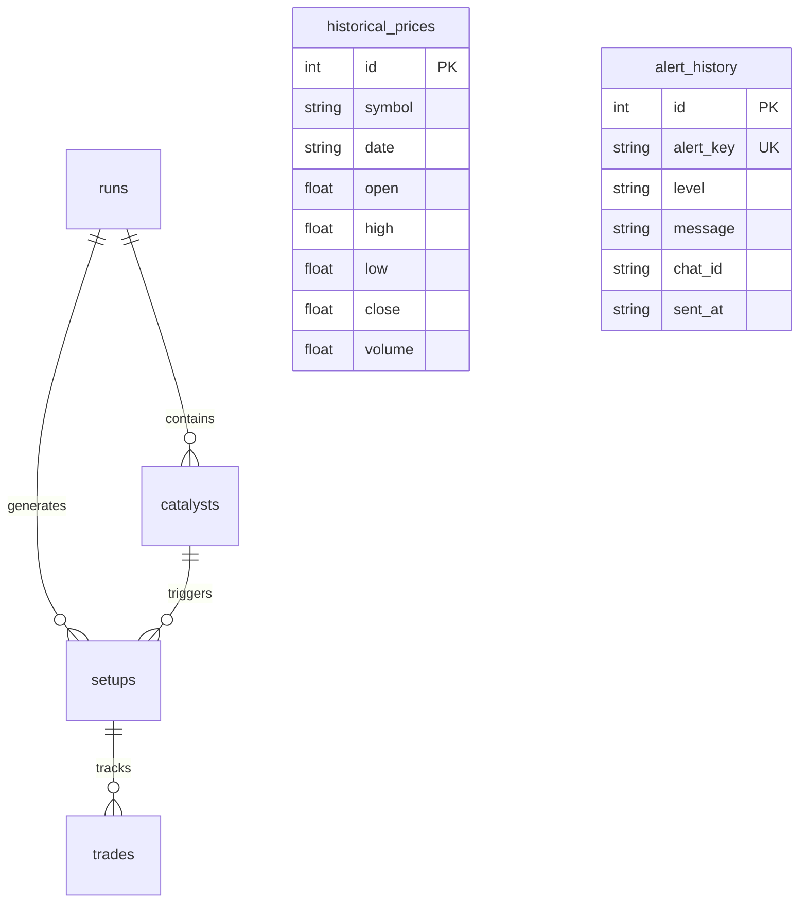

# Scheme Intel — Data Model & Schema Reference

Scheme Intel maintains historical records in an SQLite database located at `data/scheme_intel.db`.

---

## Entity-Relationship Schema

---

## Detailed Table Specifications

### 1. `runs`
Tracks every automated execution of the pipeline.
- `id` (INTEGER, PK, AUTOINCREMENT)
- `generated_at` (TEXT, NOT NULL) — ISO UTC timestamp of the scan.
- `summary` (TEXT) — Run summary narrative.
- `source_errors` (TEXT) — JSON serialized list of non-fatal source errors encountered.
- `created_at` (TEXT) — DB insertion timestamp.

### 2. `catalysts`
Stores categorized policy, industry, corporate, and tender catalysts.
- `id` (INTEGER, PK, AUTOINCREMENT)
- `run_id` (INTEGER, FK -> runs.id)
- `title` / `headline` (TEXT, NOT NULL)
- `url` (TEXT)
- `score` (INTEGER, NOT NULL) — Materiality score (0–100).
- `category` / `catalyst_type` (TEXT) — One of the 19 Stage 1 catalyst classifications.
- `companies` (TEXT) — JSON array of matched company names.
- `source` (TEXT) — Source name.
- `source_tier` (INTEGER) — Tier 1 to 5.
- `published_at` (TEXT) — Source publication timestamp.
- `event_date` (TEXT) — Date of catalyst event (YYYY-MM-DD).
- `confidence` (REAL) — Combined credibility, tier, and corroboration score.
- `sentiment_label` (TEXT) — `positive`, `negative`, or `neutral`.
- `expected_duration` (TEXT) — `short-term`, `medium-term`, `long-term`.
- `affected_business_segment` (TEXT)
- `related_scheme` (TEXT)
- `related_sector` (TEXT)

### 3. `setups`
Quantitative swing trade setups generated when a catalyst triggers watchlist momentum.
- `id` (INTEGER, PK, AUTOINCREMENT)
- `run_id` (INTEGER, FK -> runs.id)
- `catalyst_id` (INTEGER, FK -> catalysts.id)
- `company` (TEXT, NOT NULL)
- `symbol` (TEXT, NOT NULL)
- `close` (REAL)
- `entry` (REAL) — Breakout trigger price.
- `stop` (REAL) — 2x ATR trailing stop.
- `target` (REAL) — 2:1 profit target.
- `rsi14` (REAL)
- `catalyst_score` (INTEGER)
- `status` (TEXT) — `QUALIFIED` or `WATCH`.
- `prior_high20` (REAL)
- `prior_high50` (REAL)
- `breakout` (INTEGER) — 1 if breakout confirmed, 0 otherwise.
- `breakout_dist_pct` (REAL)
- `volume_avg` (REAL)
- `volume_ratio` (REAL)
- `macd`, `macd_signal`, `macd_hist` (REAL)
- `sma100`, `dma200` (REAL)
- `roc10`, `roc21` (REAL)
- `atr_pct` (REAL)
- `volatility_regime` (TEXT) — `LOW`, `NORMAL`, `HIGH`, `EXTREME`.
- `support`, `resistance`, `swing_high`, `swing_low` (REAL)
- `rs_nifty` (REAL) — Relative strength vs benchmark.

### 4. `trades`
Paper-trading and actual execution outcome tracking.
- `id` (INTEGER, PK, AUTOINCREMENT)
- `setup_id` (INTEGER, FK -> setups.id)
- `company`, `symbol` (TEXT, NOT NULL)
- `entry_price`, `stop_price`, `target_price` (REAL)
- `entry_date`, `exit_date` (TEXT)
- `exit_price` (REAL)
- `outcome` (TEXT) — `WIN`, `LOSS`, `BREAKEVEN`.
- `pnl_pct` (REAL)
- `notes` (TEXT)

### 5. `historical_prices`
Persistent OHLCV price storage ensuring offline independence.
- `id` (INTEGER, PK, AUTOINCREMENT)
- `symbol` (TEXT, NOT NULL)
- `date` (TEXT, NOT NULL) — YYYY-MM-DD.
- `open`, `high`, `low`, `close`, `volume` (REAL)
- `UNIQUE(symbol, date)`

### 6. `alert_history`
Prevents duplicate notifications across pipeline cycles.
- `id` (INTEGER, PK, AUTOINCREMENT)
- `alert_key` (TEXT, NOT NULL, UNIQUE)
- `level` (TEXT, NOT NULL) — `INFO`, `QUALIFIED`, `CRITICAL`.
- `message` (TEXT, NOT NULL)
- `chat_id` (TEXT)
- `sent_at` (TEXT)
